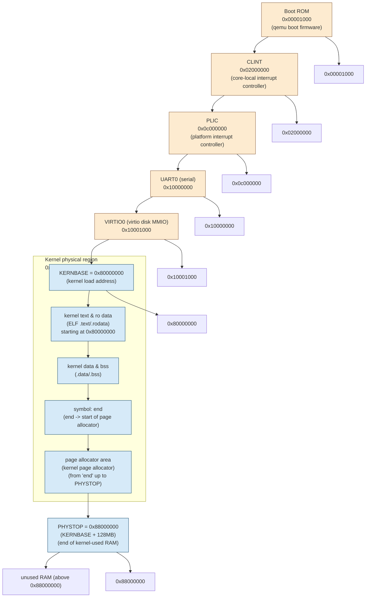

# 物理内存分配（清晰版）

下面的图仅展示物理地址空间的分配（由低地址到高地址），重点标明设备 mmio 区与内核使用的物理区域及其范围。

```mermaid
graph TB
  %% 物理地址从上到下按出现顺序排列（低地址在上）
  classDef dev fill:#fdebd0,stroke:#8b5e3c
  classDef kern fill:#d6eaf8,stroke:#1b4f72

  BootROM["Boot ROM\n0x00001000\n(qemu boot firmware)"]
  CLINT["CLINT\n0x02000000\n(core-local interrupt controller)"]
  PLIC["PLIC\n0x0c000000\n(platform interrupt controller)"]
  UART0["UART0 (serial)\n0x10000000"]
  VIRTIO0["VIRTIO0 (virtio disk MMIO)\n0x10001000"]

  %% Kernel physical region: 0x80000000 .. 0x88000000 (128MB)
  subgraph Kernel_Physical_Region["Kernel physical region\n0x80000000 — 0x88000000 (128MB)"]
    direction TB
    KERNBASE["KERNBASE = 0x80000000\n(kernel load address)"]
    KERNEL_TEXT["kernel text & ro data\n(ELF .text/.rodata)\nstarting at 0x80000000"]
    KERNEL_DATA["kernel data & bss\n(.data/.bss)"]
    KERNEL_END["symbol: end\n(end -> start of page allocator)"]
    PAGE_ALLOC["page allocator area\n(kernel page allocator)\n(from 'end' up to PHYSTOP)"]
  end

  PHYSTOP["PHYSTOP = 0x88000000\n(KERNBASE + 128MB)\n(end of kernel-used RAM)"]
  UNUSED["unused RAM (above 0x88000000)"]

  %% 连线（低地址 -> 高地址）
  BootROM --> CLINT --> PLIC --> UART0 --> VIRTIO0 --> KERNBASE
  KERNBASE --> KERNEL_TEXT --> KERNEL_DATA --> KERNEL_END --> PAGE_ALLOC --> PHYSTOP --> UNUSED

  %% 地址注释（方便查阅）
  BootROM_addr["0x00001000"]
  CLINT_addr["0x02000000"]
  PLIC_addr["0x0c000000"]
  UART0_addr["0x10000000"]
  VIRTIO0_addr["0x10001000"]
  KERNBASE_addr["0x80000000"]
  PHYSTOP_addr["0x88000000"]

  BootROM --> BootROM_addr
  CLINT --> CLINT_addr
  PLIC --> PLIC_addr
  UART0 --> UART0_addr
  VIRTIO0 --> VIRTIO0_addr
  KERNBASE --> KERNBASE_addr
  PHYSTOP --> PHYSTOP_addr

  class BootROM,CLINT,PLIC,UART0,VIRTIO0 dev
  class KERNBASE,KERNEL_TEXT,KERNEL_DATA,KERNEL_END,PAGE_ALLOC,PHYSTOP kern

```
